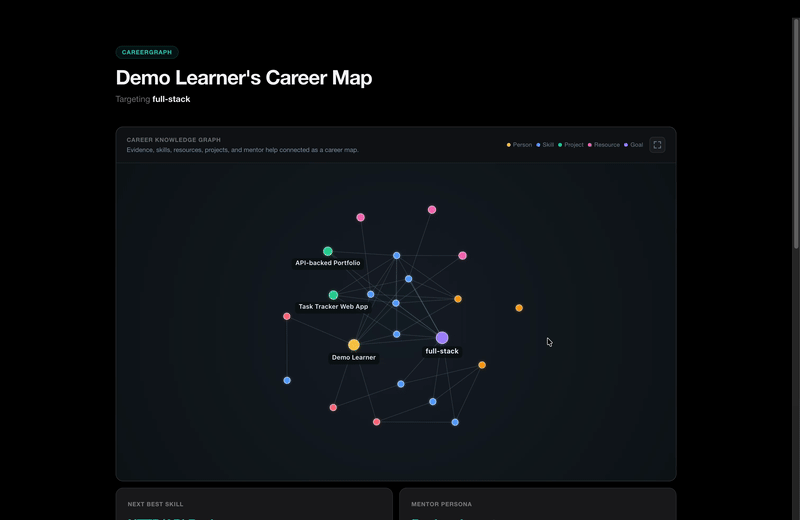
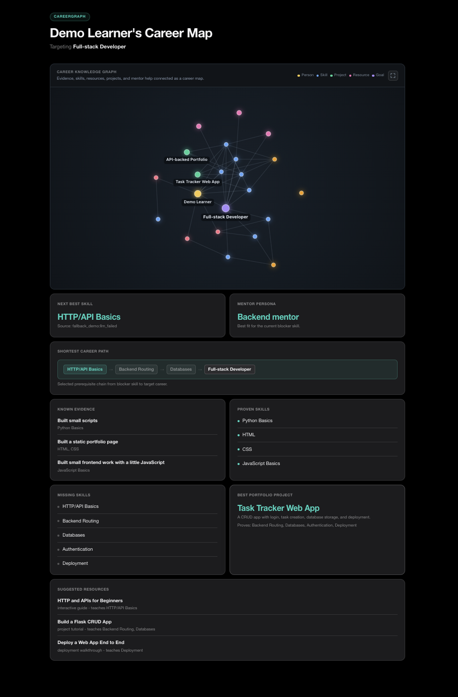
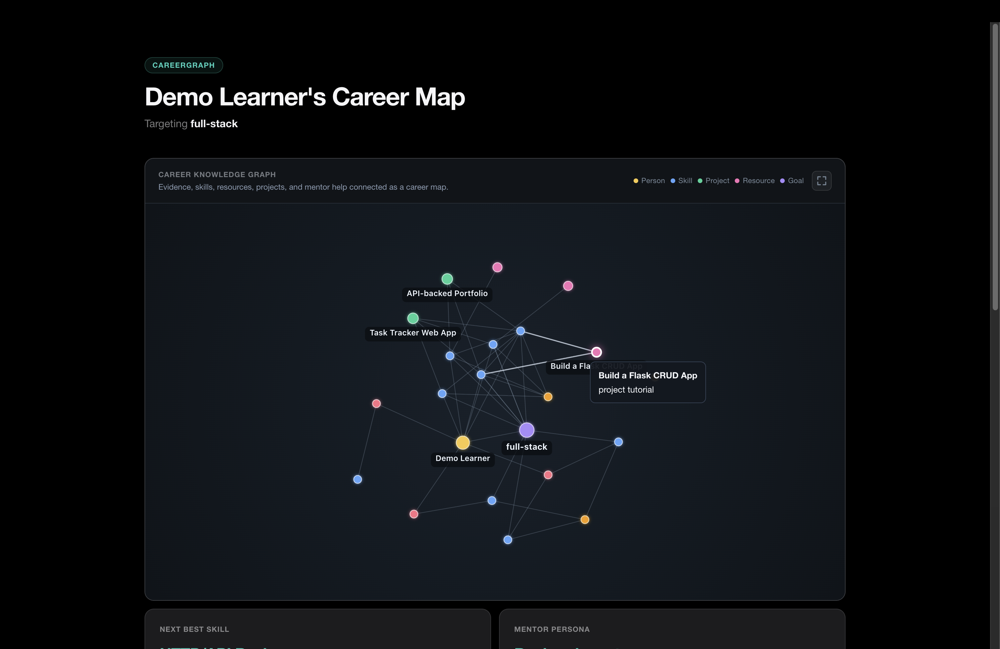
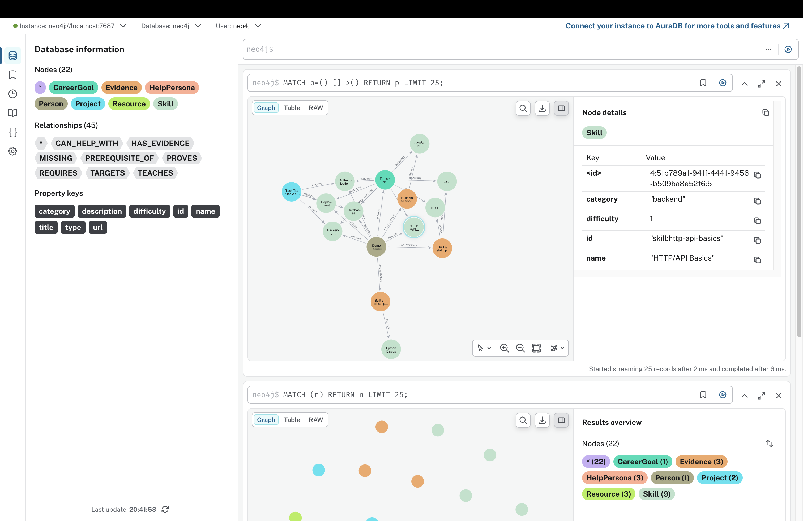
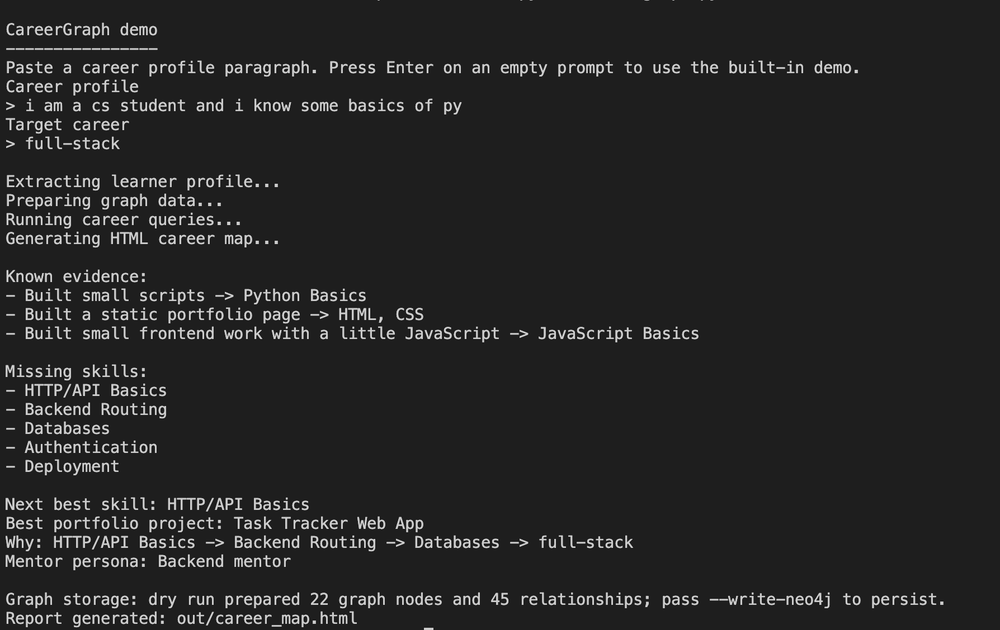

# CareerGraph

> **🥉 3rd place — Hack Night London by The Builders Collective at Tessl - May 13, 2026**
> Solo build - one evening - 39 teams - 150 people

CareerGraph is a graph-first AI career mentor. It turns a learner's career background into a
persistent knowledge graph in Neo4j, then answers graph-native questions: which skill is blocking
your progress, which project covers the most gaps, and what is your shortest path to your target role.

Unlike generic "learn X next" advice, every recommendation is justified by a graph traversal, and
not a language model guess.

## Demo



→ [Open interactive career map (HTML)](assets/career_map.html)

## Screenshots

**HTML Career Map** — color-coded graph of skills, evidence, projects, and career path:





**Neo4j Browser** — 22 nodes, 45 relationships live in the graph database:



**CLI Demo** — full pipeline output in the terminal:



## Quick Demo

```bash
.venv/bin/python careergraph.py demo --demo-fast
```

The default path is deterministic and does not require API keys or Neo4j.

## Local Installation

```bash
python3 -m venv .venv
.venv/bin/python -m pip install -r requirements.txt
```

The current local `.env` contains:

```bash
NEO4J_URI=bolt://localhost:7687
NEO4J_USERNAME=neo4j
NEO4J_PASSWORD=CareerGraphPass123
NEO4J_DATABASE=neo4j
```

`OPENAI_API_KEY` is intentionally blank. Add your key only when you want live LLM extraction.

## Optional LLM Extraction

Set `OPENAI_API_KEY` in `.env`, then run:

```bash
.venv/bin/python careergraph.py demo --use-llm
```

If the LLM output fails validation, CareerGraph retries once and then falls back to the
built-in Full-stack Developer graph.

## Optional Neo4j Persistence

Start Neo4j with Docker:

```bash
scripts/start_neo4j.sh
```

Neo4j Browser opens at `http://localhost:7474` — username `neo4j`, password `CareerGraphPass123`.

Write and query the graph:

```bash
.venv/bin/python careergraph.py demo --demo-fast --write-neo4j --query-neo4j
```

Stop Neo4j:

```bash
scripts/stop_neo4j.sh
```

## Tests

```bash
.venv/bin/python -m unittest discover -s tests
```

## Vision

CareerGraph was built in one evening as a working MVP — not a mock, not a slide deck.
The goal was a system that actually runs, writes to Neo4j, and produces a real diagnosis end-to-end.
The core architecture — graph-native reasoning over LLM-extracted knowledge — is designed to scale
into a much richer career intelligence layer.

### Richer Evidence Ingestion

- Resume and CV parsing to extract past roles, projects, and technologies as graph nodes
- GitHub activity analysis to infer proven skills from real commit and project history
- Job description parsing to auto-generate target career requirement graphs
- Course and certification records linked directly to skill nodes

### Smarter Graph Reasoning

- Skill confidence scoring weighted by evidence recency and depth
- Timeline planning with estimated months-per-skill based on difficulty and prerequisites
- Multi-career comparison showing shortest-path divergence across N target roles
- Skill demand overlay connecting the graph to live job posting frequency data

### Collaborative Knowledge

- Mentor annotation of learner graphs (mentors add evidence and prerequisite edges directly)
- Community-validated prerequisite chains (crowd-sourced skill ordering)
- Cohort comparison showing where peers sit in the same career graph

### Product Surface

- Web UI over the same Neo4j layer with interactive graph exploration
- Natural language query interface ("what is blocking me from becoming a data engineer?")
- Export to personal learning roadmaps (Notion, Obsidian, markdown)
- API integration with learning platforms (Coursera, LinkedIn Learning, Udemy)
